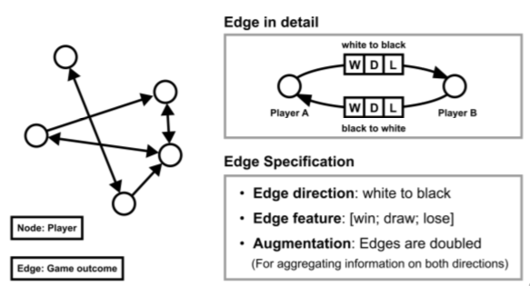
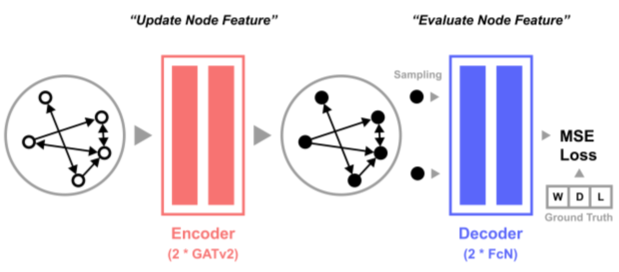
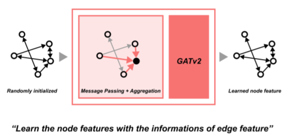
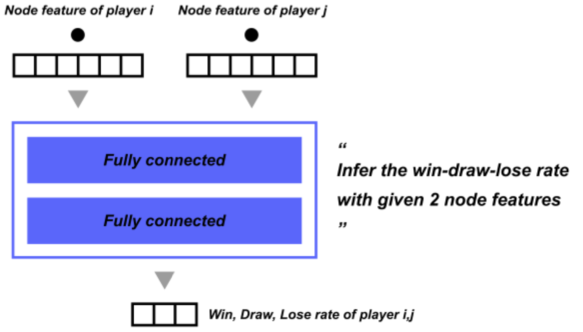
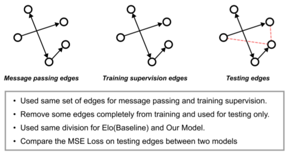

# Winning rate prediction of the chess game result with GNN

-   [Winning rate prediction of the chess game result with GNN](#winning-rate-prediction-of-the-chess-game-result-with-gnn)
    -   [Problem Statement](#problem-statement)
    -   [How to Run](#how-to-run)
        -   [Setup](#setup)
        -   [Train GNN Model \& Predict](#train-gnn-model--predict)
        -   [Train ELO Model \& Predict](#train-elo-model--predict)
    -   [Methodology](#methodology)
        -   [Graph Structure](#graph-structure)
        -   [Model Architecture](#model-architecture)
            -   [Encoder](#encoder)
            -   [Decoder](#decoder)
        -   [Evaluation](#evaluation)
    -   [Result](#result)
    -   [Future Works](#future-works)
        -   [Node feature initilization](#node-feature-initilization)
        -   [Boosting capacity of the model](#boosting-capacity-of-the-model)
    -   [Reference](#reference)
    -   [Contributors](#contributors)

## Problem Statement

Predicting the outcome of a chess game has a significant impact on research area of prediction. Statistical analysis still plays a prominent role and achieves a reasonable level of accuracy. However, one notable drawback is that ELO cannot capture the characteristics of an individual chess player due to its inability to represent the "non-transitive" relationship. For instance, if player A holds significant superiority over specific opponenets B while has lower ELO rate, ELO simply predict B is likely to win over A. This often becomes a major flaw when when predicting the game result between players.

Therefore, we propose a GATv2-based GNN model to utilize the structural information present in the dataset, such as the superiority between players, types of openings, and imbalances in win rates between black and white, in order to enhance the predictive capabilities.

Our brief solution is as below

1. Construct the graph, players as nodes, game results as edges
2. Randomly initilize node features
3. Update node features with GNN
4. Randomly select edges, and calculate the loss with real game results
5. Predict unseen game results with trained node features

## How to Run

### Setup

```sh
# Download the dataset
./setup.sh

# Download the dependencies
pip install -r requirements.txt
```

### Train GNN Model & Predict

```sh
python main.py --method gnn
```

### Train ELO Model & Predict

```sh
python main.py --method elo
```

## Methodology

### Graph Structure



### Model Architecture



#### Encoder



#### Decoder



### Evaluation



## Result

## Future Works

### Node feature initilization

1. For now, node features are initialized randomly
2. ELO value itself captures individual chess player's skill, which might be good initial point

### Boosting capacity of the model

1. Our model converges on high training error
2. Generalization error is relatively smaller than training erroor
3. Boosting capacity of the model will work well for both encoder and decoder

## Reference

[Lichess Dataset](https://database.lichess.org/)

## Contributors

[Dongwook Shin](https://github.com/jentleshin)

[Kyungho Byoun](https://github.com/byunk)
